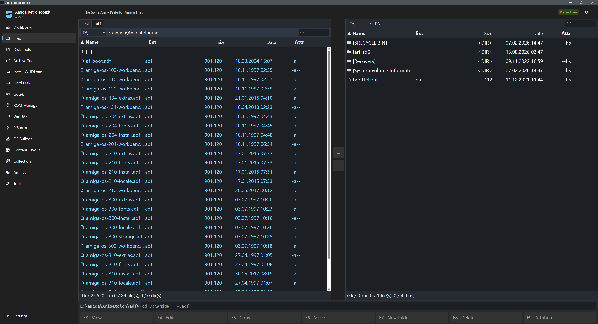
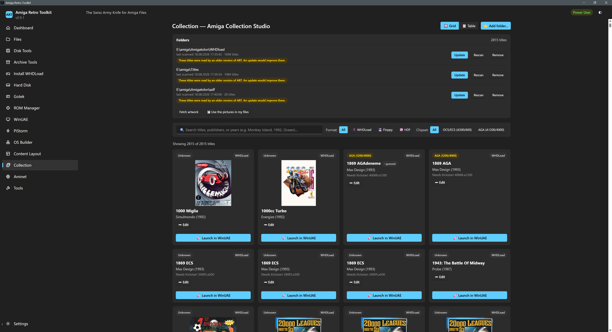
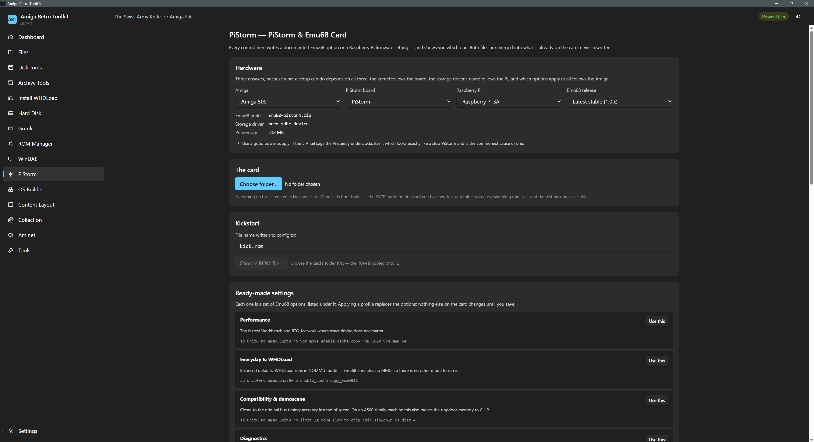
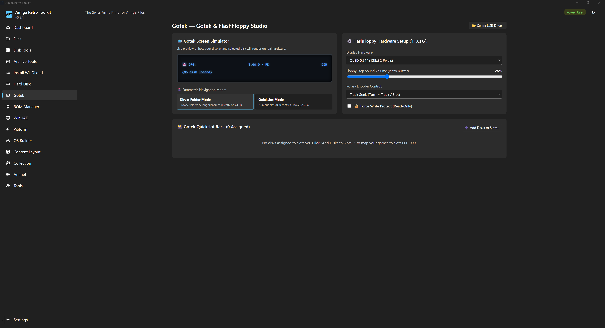
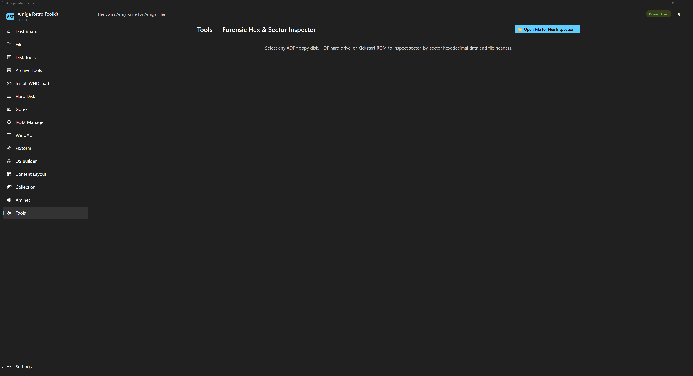

# Amiga Retro Toolkit (ART)

[](https://github.com/tolon/Art/releases/latest)
[](LICENSE)


**The Swiss Army Knife for Amiga Files**

<https://github.com/tolon/Art>

A professional Windows desktop toolkit for Commodore Amiga users. ART combines
ADF, HDF, LHA, ROM, Gotek, WinUAE and collection management into one coherent,
drag-and-drop-driven application.

> **DROP IT INTO ART.**

**0.9.0 is out, and it is asking for testers.**
[Download it](https://github.com/tolon/Art/releases/latest), try it on your own
Amiga files, and tell it what it got wrong — the nine things that still need
someone other than the author are listed under
[What still needs testing](#what-still-needs-testing), each with what to run
and what a good or a bad result looks like. **A result that went well is worth
reporting too.** ART is written for real Amigas rather than for emulation, and
the one thing nobody has done yet is flash a card it built and start an A500
with it.



*An Amiga disk from 1988 on the left — OFS, its own `----rwed` protection bits,
its own dates — and a Windows drive on the right. Copy either way. Everything
starts by dropping something on ART: it works out what a file is from its bytes,
not its name, and offers what can be done with it.*

## What it looks like

**Your library, with covers.** Point ART at the folders your games live in. It
reads each title from whatever *states* it — a WHDLoad slave's own header, an
`.rp9` manifest, the filename last — and marks anything it had to guess. Cover
art is fetched from sources you choose, and nothing reaches the network until
you ask it to.



*The two `1869` cards in the top row are the point, and they are a real pair
rather than a staged one. Both are AGA, both ask for Kickstart `40068.a1200`,
and both say so because the WHDLoad slave inside them says so. But the third
card's **name** was taken off its filename — somebody had renamed the file —
so ART marks it `~guessed` while its neighbour, named by the slave itself,
carries no mark. A guess and a statement look identical once they are on a
screen, and ART's answer is to never let them.*

**Play.** The Collection's detail panel has a Play button that hands a
catalogued title straight to WinUAE. ART picks a Kickstart from your ROM
folder, shows the machine, the ROM and the memory on a confirmation screen
before anything starts, and **refuses rather than launches** when no ROM in
your folder actually suits the title. Which machine depends on the shape. A
floppy or a plain hardfile is planned from the title's own chipset. **A
WHDLoad title is not**: it runs on one known-good profile — **A1200, AGA,
68EC020, 2 MB Chip, 8 MB Fast, Kickstart 3.x** — because a WHDLoad title does
not boot the game, it boots AmigaDOS, which starts WHDLoad, which patches the
game. Sizing that machine from a 1988 game's chipset means as many launch
configurations as there are titles, each of which has to be right on its own.
This was a reasoned decision when it landed and it has since been measured:
`1000 Miglia` (Simulmondo, 1992), an OCS-era self-booting WHDLoad hardfile
this project had already played on the old A500/OCS path, was played again
from the Collection afterwards and ran — on the default setting, where
Automatic resolves to the A1200 profile, so nobody hand-picked the machine.
One OCS-era title running is the claim, not every OCS title you own. Your own
per-title machine choice still outranks the profile, and the Fast RAM
figure is a default rather than a floor — set it lower, including to zero, and
that is what the generated configuration says. A floppy set
— plain `.adf` or `.rp9` — mounts and boots directly; a self-booting WHDLoad
hardfile (most WHDLoad titles in a real collection) mounts the same way, with
an off-by-default switch to make it writable so saves survive; a WHDLoad
*drawer* that needs a separate system image is handed that system read-only,
or, when the system supports it, boots straight into the game in one step.
Two shapes have run for real, from this project's own collection: a
self-booting WHDLoad hardfile (`1000 Miglia`, one of 1697 catalogued the same
way) reached the game, and an `.rp9`-packaged floppy title (`3D Demo`)
launched with its two floppies extracted and mounted in order. That is two
proven shapes, not all of them — see
[What still needs testing](#what-still-needs-testing) for exactly what is
still unverified and how to try it.

*(A screenshot of the Play confirmation screen — machine, Kickstart, memory,
shown before anything starts — would fit here; none exists yet.)*

**A PiStorm card, described in the words its own documentation uses.** Every
control writes a documented Emu68 option or a Raspberry Pi firmware setting —
and tells you which one. Both files are merged into what is already on the card,
never rewritten over the top.



**A Gotek, including what its little screen will say.** The OLED preview is
live: it renders the same text the hardware will, before you write anything to
the stick.



**And when you need to see the actual bytes.** A hex and sector inspector that
knows where a volume's boot block, root block and bitmap are, and will jump to
any of them.



## Which machines

**The whole classic line, not one model.** ART's file work is machine-
independent to begin with — an ADF is an ADF whether it came off an A500 or an
A4000, and FFS/OFS, RDB/HDF, LHA and ISO9660 are formats rather than machines.
Where the machine *does* matter, it is data ART carries rather than a code path
it hard-codes: built-in machine profiles ship for **A1000, A500, A500+, A600,
A2000, A3000, A1200, A4000, CDTV and CD32**. Kickstart identification,
WinUAE configuration and the compatibility check all read those profiles.
They are presets: profiles you define yourself are spec §33 and are not built
yet.

Commodore's 8-bit side is in scope too, and built: **C64 disk and tape
images** (`.d64`, `.d71`, `.d81`, `.t64`) open in the same commander and copy
out to a folder, read-only. `.tap`, `.prg` and `.crt` are identified and
described rather than browsed — a TAP is a sampled tape signal with no
directory in it.

## Status

The application builds and runs on Windows 10/11 x64. Working today: DD/HD
floppy images and hard-disk (RDB/HDF) partitions — read, write, create and
validate through one volume driver, including boot code that starts a real
Amiga (verified by booting a disk on an actual A500/A500+ — see below) — with
a Total Commander-style dual pane (browse, multi-select,
batch copy in/out/delete, sort, filter by filename mask, rename, mkdir,
attributes) over FFS/OFS volumes; **CD images (ISO9660 with Joliet, including
raw 2352-byte tracks in Mode 1 and Mode 2/XA)** and **archives (LHA, ZIP, 7z)**
opened as panes of the same manager, walked into and copied out of — to a
folder or straight into an Amiga volume; LHA WHDLoad detection with several
archives installed to a disk at once; Kickstart ROM identification; machine
profiles for the whole classic line; Gotek/FlashFloppy; PiStorm/Emu68; WinUAE
launching; **AmigaOS installed from your own media**, host-side into a
distribution tree and Amiga-side by running an update package's own installer
inside the emulator; **Aminet browsed, downloaded and installed** from a
catalogue held locally; a background job queue with progress/cancel;
an operation log; Beginner/Power User modes; and the drag-and-drop Workflow
Engine behind "what can I do with this?".

Every screen scales with Ctrl +/-/0 and every colour pair in both themes is
**measured against WCAG in CI** rather than judged by eye — most of the people
this is for are over fifty, and contrast is not decoration.

**A collection you can keep.** ART indexes your folders once and remembers:
a library that takes minutes to read is there the moment the screen opens, and
an Update re-reads only what changed. Each title's facts come from whatever
*states* them — a WHDLoad slave's own header, an `.rp9` manifest, a filename
last — and the screen marks anything guessed rather than read. Cover art is
fetched from sources listed in Settings, which you can switch off or point
elsewhere; **nothing reaches the network until you ask it to.** Where a name
could only be taken off a filename, ART proposes a tidier one and you accept it
— it will not rename anything by itself, and where the evidence runs out it
says nothing and leaves you the edit box. Measured against a real 2787-title
library across two folders.

**Software from Aminet, without a browser.** ART syncs Aminet's own index —
**85 472 packages**, measured 2026-08-24 — and keeps it locally, so search and
browse work with no connection at all. A package downloads to a folder you
choose, is checked against the size the index claimed and its own SHA-256, and
can be installed straight into a floppy image or a hard-disk partition. An
update view compares what you have downloaded against the catalogue as it
stands now. There is no address bar: every request is built from a **configured
mirror** plus a validated repository path, so there is no code path anywhere in
ART that fetches a URL somebody typed. The mirror list is yours to edit and
reorder, and it is remembered. Nothing leaves the machine until you ask it to.


**PiStorm cards, both directions.** ART opens a real one — an MBR with a FAT32
boot partition and one to three Amiga disks inside it, each carrying its own
partition table at a byte offset inside the card — and shows it as the list of
disks the m68k side actually sees, verified against CaffeineOS and MultibootOS.
It can also **build one**: the partition table, a FAT32 boot partition carrying
your own Emu68 release and Kickstart, and a partition table at the start of
every Amiga disk. **PFS3 and FFS volumes are formatted and filled by ART
itself** — no external tool required, though one can be configured as a
fallback for two named gaps.

The card can carry **more than one complete AmigaOS** — 3.1 for compatibility
beside 3.2 for daily use, say. ART writes no boot menu, because AmigaOS already
has one: hold both mouse buttons while the machine starts and its own Early
Startup screen lists every bootable partition. What ART sets is which one starts
when nobody holds anything, and if two of them claim that equally it **says so
rather than choosing between your systems**. It also refuses to build an FFS
partition larger than the 4 GB a Kickstart before v46 can address — that one is
a partition which corrupts the drive, not an inconvenience. And it can put your
WiFi details on the card while you are setting it up, so the Amiga is on the
network the first time it boots; the passphrase is the one thing ART
deliberately does not remember.

One limit, said here rather than discovered later:
**no card ART built has been flashed or booted.**

**AmigaOS, built from your own install media.** Point ART at your own AmigaOS
floppies or CD and it produces a **distribution tree** — a Windows folder that
is the finished system volume file for file, with an Amiga-metadata `.uaem`
sidecar beside each one and a `distribution.json` recording which component and
which disc every file came from. It does not copy disks; a component is a named
set of paths, because `ModulesA1200_3.2.adf` holds fourteen commands and
thirteen of them are *older* than the ones `Workbench3.2` already carries.
Releases are data, not code: AmigaOS 3.2 and 3.9 each ship as a JSON recipe.
Both have been run against the owner's own media — the 36-disk 3.2 set and a
469 MiB `AmigaOS39.iso` — and both trees boot to a clean Workbench under WinUAE
with a licensed ROM. The 3.2 tree also boots off a PFS3 volume ART formatted
and filled itself.

**And it installs the BoingBags — by running their own installer, not by
opening them.** An AmigaOS 3.9 update package is a job ART cannot do from
Windows at all: the payload is a password-encrypted archive and the password
lives inside the package's own Amiga-side `Updater`. **ART decrypts nothing and
bypasses no protection.** Instead it does what every established distribution
builder does — it runs the installer the way the package intends. ART mounts
three volumes under WinUAE (a **copy** of your tree as data, the package as
data, and its own one-file boot volume at the highest boot priority), boots a
generated `Startup-Sequence`, runs the `Updater`, reads the one word the Amiga
writes back, closes the emulator it started, and promotes the copy over your
tree **only** when the installer reported success. Your original is never the
thing being written to.

Measured end to end on the owner's own material, 2026-08-21: **BoingBag 1 in
169.1 s** (3 795 → 3 859 files), then **BoingBag 2 on that result in 138.1 s**
(3 868 files). The result was then booted and **asked** rather than inferred —
`version full` answered **`Workbench 45.3 (07-Dec-01)`**, where the same tree
had answered `45.1 (13-Nov-00)` before.

Three refusals come with it, and each names what to do next:

- **The chain is enforced.** Clean 3.9, then BoingBag 1, then BoingBag 2. A run
  whose prerequisite is missing is refused **before anything is copied** — a
  BoingBag 2 applied to a tree BoingBag 1 never touched boots, and is quietly
  wrong, which is the worst outcome available.
- **An installer too old to run under an emulator is refused by its own
  version.** `BoingBag39-1.lha` ships `Updater` 45.13, which cannot install a
  BoingBag on UAE; ART reads the program's `$VER:` marker and names the archive
  that fixes it (`BoingBag39-1-UAE.lha`, `Updater` 45.15) rather than launching
  it to fail.
- **The disc the installer verifies has to be there.** The `Updater` checks for
  your AmigaOS 3.9 CD, so ART asks for an image of it up front instead of
  letting the Amiga stop on a requester nobody is there to answer.

One boundary, said plainly: the panel for this screen has never been driven by
a person. Every run above went through the engine's own test hook.

**Content-first detection**: what a file *is* comes from its bytes, not its
name, so an `.img` holding a floppy is a floppy and a `.dat` holding an LHA
still opens.

**Application Size** (Ctrl +/-/0, or Settings) scales the whole interface from
70 % to 250 % and is remembered — as is every other choice ART offers. A
right-hand-edge complaint at 130 % ([ART-099](docs/ISSUES.md#fixed)) did not
reproduce when the running application was measured across seven screens and
three sizes; what was real — content being clipped with no way to scroll to it
— is fixed.

### Verified how, exactly

ART's disk writer has been checked four ways, and the last one is the one that
matters:

1. `cargo test` — ART agrees with itself.
2. `amitools` and 7-Zip — ART agrees with implementations that share no code
   with it, in both directions.
3. **Two disks ART wrote, opened under licensed Kickstart and Workbench in
   WinUAE / Amiga Forever** — one mounted and read back, one booted to a CLI
   prompt.
4. **A real Amiga.** On **2026-08-12**, `test/art-bootable-test.adf` cold-booted
   an **A500 / A500+** running **Kickstart 3.9** — served from a **Gotek** as
   `DF0:` — straight to an AmigaDOS `1>` prompt.

Rung four is what rung three could not be: the boot code is ART's own,
assembled from the published LVO table, and running it on a real **68000**
(the emulated passes were an A1200's 68020 and an A500+ *configuration*) was
an assumption until then.

**What is still not claimed:** a Gotek is not a mechanical drive. Nothing ART
has written has been through a real floppy head onto physical magnetic media.
That rung is listed by name in [`test/README.md`](test/README.md) and is not
being quietly folded into the one above it — claiming hardware ART has not
been tried on is the one thing [docs/FEATURES.md](docs/FEATURES.md) exists to
prevent.

### What still needs testing

The owner has decided the remaining verification happens by the community,
not alone. This list is kept honest in both directions, so start with what has
since stopped being a gap:

**Proven since this section was written.** The shipped release build has been
driven by a person rather than only by `pnpm tauri dev`, and it immediately
found two defects nothing in 2260 tests had ([ART-195](docs/ISSUES.md#fixed),
[ART-196](docs/ISSUES.md#fixed)) — which is the argument for this whole section.
Titles have been played from the Collection panel by hand: an `.rp9` floppy
title (`3D Demo`), and — on 2026-08-21, through the new A1200 WHDLoad profile —
`Akira` (AGA) and `1000 Miglia` (OCS-era), both of which ran. `1000 Miglia` is
the one that settles something, because this project had already played it on
the *old* A500/OCS path: same file, same ROM folder, only the machine profile
changed, and it was left on Automatic rather than hand-picked. **One OCS-era
title on the A1200 profile is the claim** — not every OCS title in a
collection. And a **Turkish** sentence has finally
been read on a running screen by someone who speaks it: the new WHDLoad
Kickstart refusal, judged clear, and the launch then worked
([ART-062](docs/ISSUES.md#open)). That is one sentence out of 1916, so the
language as a whole is still unseen — but it is no longer zero.

### How to report what you find

**[Open an issue](https://github.com/tolon/Art/issues/new)** — a result that
went *well* is as useful as one that did not, because the gaps below are
unverified in both directions.

Four things make a report actionable, and the third is the one people leave
out:

1. **What you did, what you expected, what happened instead.** One sentence
   each is enough.
2. **Your ART version** — Settings → About shows it, taken from the build
   itself so it cannot disagree with the installer — and your Windows version.
3. **The sentence ART showed you, copied rather than described.** ART's
   refusals carry an `ART-NNN` id on purpose; that id says exactly which check
   fired, and *"it said something about a Kickstart"* does not.
4. **`operations.jsonl`**, if a file was involved — it is in
   `%LOCALAPPDATA%\com.amiga-retro-toolkit.desktop\logs\` and it records every
   operation ART performed, whether it succeeded, and what it backed up. Paste
   the last few lines. `art.log` beside it has the technical detail.

**Nothing in either file is sent anywhere by ART** — you attach them or you
do not. And if something went wrong with your own Amiga files, say so first:
ART backs up before it changes anything, so the backup path is in that log and
recovering it comes before diagnosing anything.

**Still open, and each one is a concrete gap rather than a vague "try it and
see"** — what to run, and what a good or bad result looks like:

1. **A bare `.adf` floppy set (no `.rp9` wrapper).** Only an `.rp9`-packaged
   floppy set has actually launched. Catalogue a folder holding a plain
   multi-disk `.adf` title, open its detail panel and press Play. **Good:**
   WinUAE starts with the disks mounted in the order the panel shows, and
   boots. **Bad:** the wrong disk order, a missing disk, or a refusal that
   should not have happened.
2. **An `.rp9`-packaged *hardfile* title.** 102 of these are in this user's
   collection and none has run. This is the shape [ART-141](docs/ISSUES.md)
   was found and fixed in review, but the fix has never been exercised
   against a real launch. Play one. **Good:** ART extracts the hardfile entry
   named inside the package (never the `.rp9` zip itself) and mounts it.
   **Bad:** WinUAE opens the wrong file, or reports it cannot be mounted.
3. **The WHDLoad *drawer*-plus-system Y1/Y2 path.** Nothing in this
   collection produces this shape — an unpacked WHDLoad pack paired with a
   separate bootable system image — so only its own unit tests have ever
   exercised it. Configure a bootable system image in Settings → Play, then
   Play a drawer-based (not hardfile) WHDLoad title. **Good:** Y1 mounts your
   system read-only and hands control over, or Y2 (where supported) boots
   straight to the game. **Bad:** a bare AmigaDOS CLI prompt instead of the
   game — this exact failure is how [ART-145](docs/ISSUES.md),
   [ART-147](docs/ISSUES.md), [ART-148](docs/ISSUES.md) and
   [ART-149](docs/ISSUES.md) were each found — or your original system image
   being modified, which it must never be.
4. **Any VHD- or RDB-container system image.** [ART-146](docs/ISSUES.md)
   stopped ART forcing bare-image geometry onto every hardfile, VHD and RDB
   containers included; the fix reads the file's own bytes (`conectix`,
   `RDSK`) instead of assuming one shape for all of them, but has **not**
   been retried against a real emulator run — the one real run since
   (`1000 Miglia`) is a bare `DOS\1` image, the branch ART-146 left
   unchanged. **Half of this closed on 2026-08-24** and the half that is
   left is the half that needs a person: ART now reads the real 1.2 GB
   `AmiKit.hdf` itself rather than a fixture built from its first eight
   bytes, and two independent readers agree about it - it is a *dynamic*
   VHD carrying 3.9 GB of disk, its footer checksum matches, and the line
   ART writes for it has the empty device name and zeroed geometry the fix
   was about. What that measures is the configuration ART writes, **not
   what WinUAE does with it.** So: launch a title or a WHDLoad system (via Y1)
   backed by a VHD container (e.g. an AmiKit-style `.hdf`) or a plain RDB
   hardfile. **Good:** WinUAE mounts and reads it normally. **Bad:** "Not a
   DOS disk in unit 0" — the exact error ART-146 was filed against.
5. **Whether a WHDLoad save survives with the writable switch on.** Measured,
   not proven: two titles were played with *allow writes* on, the emulator
   window was closed rather than quit through WHDLoad's own key, and the
   images were read back afterward — same byte counts and timestamps as
   before, so the mount really is read-write (the generated configuration
   says `rw`) but nothing wrote in that session. The likely explanation is
   that a WHDLoad game writes its save or high-score table on a clean exit,
   not while running, and this session never gave it one. Play a title with
   *allow writes* on, exit through WHDLoad's own quit key rather than closing
   the window, then reopen and check for the save. **Good:** the save is
   there. **Bad:** still nothing after a clean exit, which would mean the
   switch does not do what it claims.

6. **The Amiga-side install screen, driven by a person.** The engine installs
   both BoingBags (above) and every one of those runs went through its own
   test hook, never the panel. On the OS Builder's Install screen, find
   **"Run a package's own installer on the Amiga"**, choose your tree, the
   package, its own archive and your Kickstart, and run one. **Good:** the confirmation names the machine
   and the volumes, the progress stream moves, and the ending is one of four
   distinct sentences with a next step. **Bad:** a sentence that is confidently
   wrong about what happened — this round's signature defect — or an emulator
   window that opens with no warning first.
7. **The Aminet studio, driven by a person.** The whole chain has been run
   against the real Aminet and it works — each shipped mirror asked
   separately, the index synced and reloaded, and a real package downloaded,
   checked and unpacked (`cargo test live_aminet -- --ignored`). What has never
   happened is somebody pressing the buttons in the running application. Sync,
   search for something you want, download it, and install it into a floppy
   image. **Good:** the catalogue fills, the download lands where you chose it
   to, and the install names what it put where. **Bad:** a progress bar with no
   total behind it, or a mirror failure that does not say which mirror.
8. **A card with two AmigaOS environments on it.** ART will build one, and the
   Amiga's own Early Startup screen is what chooses between them — ART writes
   no menu. Build a card with a second system, then hold both mouse buttons at
   power-on. **Good:** both systems are listed, and the one ART gave the higher
   priority is what starts when you hold nothing. **Bad:** only one appears, or
   the wrong one starts — and if ART warned you the two were tied, that warning
   is the thing to report on.
9. **A PiStorm card ART built, flashed and booted.** Everything on the code
   side is finished, tested, and cross-checked against 7-Zip and `hst-imager`;
   what is missing is a microSD card and a Pi. Build a card image, write it
   with whatever card writer you already use (ART deliberately does not write
   to raw devices), fit it and power on with HDMI attached. **Good:** Emu68
   starts and the Amiga volumes ask to be formatted or mount. **Bad:**
   anything else — and the image health check's report is the first thing to
   send. **This is the project's 1.0 bar**, not a bigger version number.

Found something? File it the way every other defect in this project is
filed — see [docs/ISSUES.md](docs/ISSUES.md) for the format, and
[CONTRIBUTING.md](CONTRIBUTING.md) for how to open one.

Data safety is enforced in `core/safety`: every write is atomic, and files are
backed up to `.art-backup/` before being replaced (or, for images too large to
hold in memory, journaled block-by-block). Hand-tuned configuration files are
edited in place, never regenerated.

The interface ships in English and Turkish. The language is chosen in
Settings and remembered across restarts. Error messages coming from the Rust
core are still English regardless of the chosen language.

Not yet built: SFS (partitions using it are listed but their contents are not
readable), DMS/ADZ conversion, recovery tools, and writing *into* a CD or an
archive (both are read-only, deliberately and permanently).

Three fields in the Collection — chipset, genre and rating — are usually empty,
and that is a shortage of sources rather than of code. Lemon Amiga refuses
automated requests outright; Hall of Light publishes only web pages, and ART
fetches index files, never pages; OpenRetro has exactly the right data and
documents no way in. ART leaves them blank rather than guessing.

| | |
|---|---|
| Where the project is, what is next | [docs/STATUS.md](docs/STATUS.md) |
| Feature-by-feature state | [docs/FEATURES.md](docs/FEATURES.md) |
| Known defects | [docs/ISSUES.md](docs/ISSUES.md) |
| Phase definitions | [docs/roadmap.md](docs/roadmap.md) |
| Released changes | [CHANGELOG.md](CHANGELOG.md) |

## Install

**[Download the latest release](https://github.com/tolon/Art/releases/latest)** —
Windows 10/11, 64-bit. Two installers, and either is fine:

| File | What it is |
|---|---|
| `Amiga.Retro.Toolkit_<version>_x64_en-US.msi` | the Windows Installer package — use this one if your machine is managed, or if you want to deploy it |
| `Amiga.Retro.Toolkit_<version>_x64-setup.exe` | the NSIS installer — a smaller download and the usual choice |

Nothing else is needed: the WebView2 runtime ART draws its interface with is
already on Windows 10 and 11, and ART bundles no Amiga content, so there is
nothing to license or download alongside it.

**The installers are not code-signed**, so SmartScreen will say "Windows
protected your PC" the first time. That is the absence of a certificate, not a
verdict on the file — *More info* → *Run anyway*. If you would rather not take
anybody's word for it, the release is built by
[a public workflow](.github/workflows/release.yml) from the tagged commit, and
you can build the same installers yourself with the steps below.

**Where ART puts things** — worth knowing before you report anything, because
two of these are what a bug report needs:

| What | Where |
|---|---|
| Settings, the catalogue, the download cache | `%APPDATA%\com.amiga-retro-toolkit.desktop\` |
| `art.log` and `operations.jsonl` — every operation ART performed, and what happened | `%LOCALAPPDATA%\com.amiga-retro-toolkit.desktop\logs\` |
| Working files (staging, previews, unpacked packages) | wherever you point the scratch folder — ART asks once, up front, and pressing Next keeps the default |

ART does not write to any of your own disks unless you ask it to, and every
operation that changes a file backs it up first and tells you where the backup
went.

## Requirements

*For building from source. To just use ART, see [Install](#install) above.*

| Tool | Version | Notes |
|------|---------|-------|
| **Rust** | 1.93+ (stable) | MSVC toolchain (`x86_64-pc-windows-msvc`) |
| **MSVC Build Tools** | VS 2022 | "Desktop development with C++" workload |
| **Node.js** | 20+ | for the frontend |
| **pnpm** | 9+ | package manager |
| **WebView2 Runtime** | any | preinstalled on Windows 10/11 |

## Setup

### 1. Rust toolchain (MSVC)

```powershell
# Install via https://rustup.rs, then ensure the MSVC target is default:
rustup default stable-x86_64-pc-windows-msvc
rustc -vV   # should show: host: x86_64-pc-windows-msvc
```

### 2. MSVC C++ Build Tools

Install **Visual Studio 2022** (Community is fine) or **Build Tools for Visual
Studio 2022** with the **"Desktop development with C++"** workload selected.
This provides `cl.exe`/`link.exe` that the MSVC Rust target requires.

### 3. Frontend dependencies

```bash
pnpm install
```

## Development

```bash
# Run the app in dev mode (hot-reload frontend + Rust rebuild)
pnpm tauri dev

# Type-check the frontend
pnpm lint

# Run the frontend unit tests
pnpm test

# Run Rust unit tests
cd src-tauri && cargo test

# Production build (produces .msi + .exe installers)
pnpm tauri build
```

Build output:

```
src-tauri/target/release/bundle/
├── msi/   Amiga Retro Toolkit_0.9.0_x64_en-US.msi
└── nsis/  Amiga Retro Toolkit_0.9.0_x64-setup.exe
```

## Architecture

```
UI (React + TypeScript)
        ↓  Tauri commands
Application Services / Commands
        ↓
Workflow Engine  ←  Detection
        ↓
Amiga Core (Rust, platform-independent)
├── volume (the filesystem driver + writer) · adf · hdf · rdb · mbr · fat32
├── card (an SD card as the list of disks the m68k side sees)
├── osinstall (a distribution tree, built from your own install media)
├── preload (putting that tree onto a card) · gameindex · artwork
├── amigainstall (running a package's own installer, on the Amiga)
├── distro (which distributions, as data) · amiganet · layout · launch
├── archive (lha · zip · 7z, read-only) · iso · rom · cbm · whdload · vhd
├── analysis · compatibility · conversion · validation · hashing
├── security (hostile input) · safety (your data against ART itself) · jobs
├── sources (the mirrors, and every rule about where ART may fetch from)
        ↓
Platform Services → Windows
```

The Amiga core is **platform-independent Rust** — no Tauri types, no Windows
APIs, and no network. Where it needs something platform-specific it declares a
trait and the implementation lives outside — three of them: `MirrorClient` (the
network), `VolumeFormatter` (launching an external imager) and `HostRecycler`
(the Windows Recycle Bin). `src-tauri/src/net/` is the only place in ART that
opens a connection. This keeps the core unit-testable and leaves a future CLI shell
open. See [docs/architecture.md](docs/architecture.md).

## License

Copyright (C) 2026 tolon.

**GNU General Public License v3.0 or later** (`GPL-3.0-or-later`). See
[LICENSE](LICENSE).

ART's dependencies are permissively licensed (MIT / Apache-2.0 / Zlib / CDLA)
with **one deliberate exception**: `libpfs3`, the PFS3 implementation ART writes
real PiStorm cards with, is **LGPL-3.0-or-later**. Weak copyleft, compatible
with ART's own licence, and taken in preference to writing a second filesystem
writer from scratch. All of them are listed in
[THIRD_PARTY_LICENSES.md](THIRD_PARTY_LICENSES.md) and checked on every push by
`cargo deny`. ART itself distributes **no** Amiga ROMs, no AmigaOS files and no
copyrighted software — see [docs/licenses.md](docs/licenses.md).
